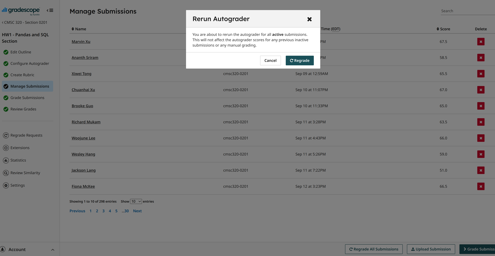
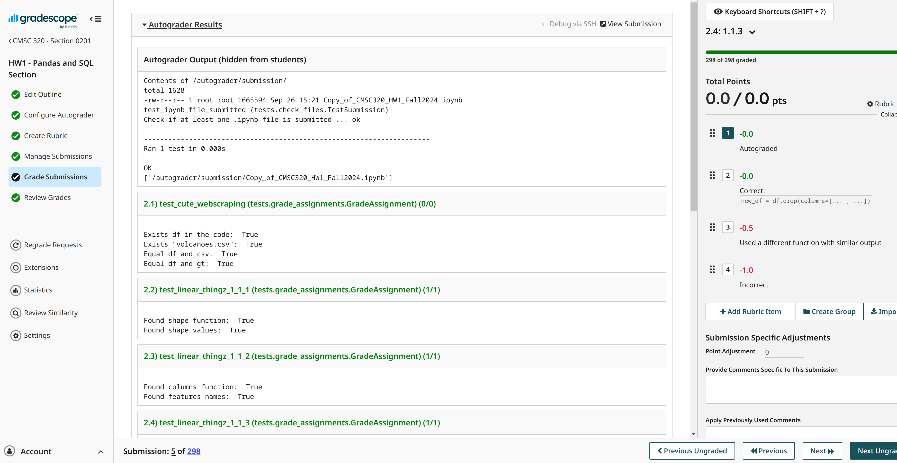

### Overview
This autograder is developed based on the Gradescope Autograder Documentation. Its primary function is to execute specific parts or entire cells from a student's .ipynb file and grade them according to custom rubrics. These rubrics may involve: **1) inspecting the output variables from the notebook (Variable Grading)**, or **2) checking for specific text patterns within designated cell ranges (Text Grading)**.


### Installation
- The basic required libraries can be install from the `requirements.txt` file
```
$ git clone https://github.com/lyhan12/Autograder_CMSC320Fall2024_HW1/
$ pip install -r requirements.txt
```
- Depending on the specific problems being graded, additional libraries (e.g., torch, torchvision, etc.) may be required. These libraries should be installed as needed, based on the requirements of the graded problems.
```
$ pip install (ADDITIONAL_LABRARIES)
```

### Quick Example
- An example submission file is included in the repository. You can quickly test this autograder in your local environments with the below command. It will show the autograding results on this submission file.
- You can manually set the ipynb submission file by changing the ``--notebook_path`` argument.
```
$ python run_tests.py --notebook_path example/example_submission.ipynb --result_path result.json --debug

```
```
============ JSON Result ============
2.5: 2.0/2.0 (test_Liner_Shenaniganz_1_2_1 (tests.grade_assignments.GradeAssignment.test_Liner_Shenaniganz_1_2_1))
2.6: 2.0/2.0 (test_Liner_Shenaniganz_1_2_2 (tests.grade_assignments.GradeAssignment.test_Liner_Shenaniganz_1_2_2))
2.7: 3.0/3.0 (test_Liner_Shenaniganz_1_2_3 (tests.grade_assignments.GradeAssignment.test_Liner_Shenaniganz_1_2_3))
2.8: 10.0/10.0 (test_Tailoring_Time_1_3 (tests.grade_assignments.GradeAssignment.test_Tailoring_Time_1_3))
2.1: 0.0/0.0 (test_cute_webscraping (tests.grade_assignments.GradeAssignment.test_cute_webscraping))
2.2: 1.0/1.0 (test_linear_thingz_1_1_1 (tests.grade_assignments.GradeAssignment.test_linear_thingz_1_1_1))
2.3: 1.0/1.0 (test_linear_thingz_1_1_2 (tests.grade_assignments.GradeAssignment.test_linear_thingz_1_1_2))
2.4: 1.0/1.0 (test_linear_thingz_1_1_3 (tests.grade_assignments.GradeAssignment.test_linear_thingz_1_1_3))
```


### Requirements for Autograding

If the assignment question is well-structured for autograding, implementating the rubric will typically require just a few lines of code (in the `tests/grade_assignments.py`). Then the autograder can be a efficient tool for grading. So, the problem specifications should be clear enough to ensure that the submitted .ipynb file meets the following conditions:
- The submission should include `only one .ipynb file`.
- Each question must have clearly `recognizable tokens marking the beginning and end of the question`. (In most cases, the question names can be used for this, such as, `"TASK 1.0: Cute Webscraping (5 points)"` and `"TASK 1.1: 1 Liner Thingz (3 points)"`. Students never touch it and we can manually regrade a few exceptions)
- (**For Variable Grading**) `The name of the variable to be graded should be fixed` (e.g. `new_df`).
- (**For Text Grading**) The expected answer should be straight-forward and simple enough to be mached by regex.
- Good Candidates
  - When checking numbers or some simple text tokens.
  - When we know the name of specific output variable (It should be specified in the question)
- Bad Candidates
  - Grading wrong texts with students' opinions
  - When we do not know the variable names that students will use
  - When we graiding visual results (e.g. plots)

### Autograding Rubric Example
This is an example of autograding rubrics for a well-formatted problem. 
The begining end of relevant cells are identified by question titles (e.g. `TASK 1.3: Tailoring Time (10 Points)`). The autograder executes the cells from the beginning of the ipynb file to the end_cell of the question (Yes, in this case, the `beginning cell` is actually not needed). The `new_df` variable is graded according to predefined rubrics implemented by the graders. 
```
    @partial_credit(3.0)
    @number("2.7")
    def test_Liner_Shenaniganz_1_2_3(self, set_score=None):
        print('')

        begin_cells = find_cells_with_text(self.notebook_path, "**1.2.3:** *In one line of code, make a **new column** called **'totalDeaths'** that takes the **max** of the values given between")
        begin_cell = begin_cells[0]
        begin_cell_idx = begin_cell['index']

        end_cells = find_cells_with_text(self.notebook_path, "#### **TASK 1.3: Tailoring Time (10 Points)**")
        end_cell = end_cells[0]
        end_cell_idx = end_cell['index']

        cell_vars = extract_variables(self.notebook_path, cell_idx=end_cell_idx - 1)

        new_df = cell_vars.get("new_df", None)

        exists_new_df = (new_df is not None) and (type(new_df) == pd.DataFrame)

        has_totalDeaths = "totalDeaths" in new_df.keys()

        totalDeaths_gt = new_df[['deathsTotal', 'deaths']].max(axis=1, skipna=True)
        totalDeaths = new_df["totalDeaths"]

        correct_totalDeaths = (totalDeaths_gt.equals(totalDeaths))

        print("Exists new_df: ", exists_new_df)
        print("Has totalDeaths: ", has_totalDeaths)
        print("Correct totalDeaths: ", correct_totalDeaths)

        set_score(0.0)
        if exists_new_df:
            if has_totalDeaths:
                set_score(1.0)
                if correct_totalDeaths:
                    set_score(3.0)
```

### Implementing the Autograder for New Custom Assignment
- Implement your rubrics in `tests/grade_assignments.py`. Refer to the example above. You can use it as a template and you can also find useful functions from `utils.py`
- You should specify
  - (1) Identify the beginning and end of the cells corresponding to each question (Simply use the quetion titles like the above example)
  - (2) Implement required inspections
  - (3) Set scores for each case

### How to Run Autograder in the Gradescope
- You can refer to the offical Gradescope documents for the detailed explanation about how to upload the Autograder.


**0) Setting the outline for the autograded questions**
- Navigate to Gradescope -> Edit Outline Tab
- You should set scores for `the autograded questions` at the `Autograder` question item in the outline. The autograded questions are graded as a whole and can not have subquestions.
- Assign scores for **autograded questions** under the **Autograder** item in the outline. Note that the autograded questions are evaluated as a single unit and cannot contain subquestions.
- For regrade requests, the outline should include subquestion items (with zero scores). You can manually adjust extra scores to each subquestion when regrade requests are submitted.
  


**1) Uploading the autograder in the Gradescope**
- Zip all the autograder files, making sure to include the files themselves directly, not as a directory.
- Upload to the Gradescope webpage


**2) Running the autograder**
- Run the augorader: Gradescope -> Manage Submissions Tab -> Regrade All Submissions Button
- This will not affect manual grading; it only triggers the autograder. Simply click the "Run" button when the pop-up appears.



**3) Inspecting the autograder results**



### When Regrading the results of the Autograder
- You can manually adjust the scores for each regrade request without needing to re-run the autograder.
